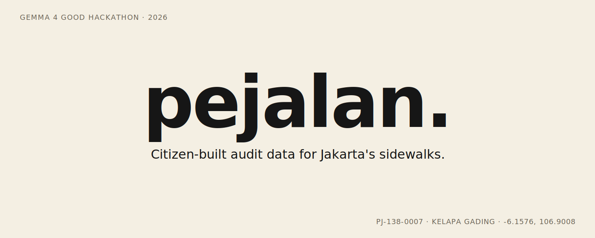

<p align="center">
  
</p>

# pejalan

An Android app for auditing the state of Jakarta's sidewalks. Point your phone at a trotoar, take a photo, and the app classifies what's wrong with it — broken paving, illegal parking, a missing accessible-tile strip, no sidewalk at all — and writes a structured report. The classifier is on-device (Gemma 4 E2B via LiteRT-LM), so photos never leave the phone in Lokal mode. There's also a Cloud mode that calls Gemini Flash if you'd rather not download the local model.

The point is simple: anyone with a mid-range Android phone can contribute audit data. No special training, no server account, no waiting on a city survey.

## Quick start — Cloud mode (recommended for judges)

For anyone who wants the fastest path to seeing the app work.

1. Download the APK from the [Releases](../../releases) page.
2. Sideload onto any arm64 Android device.
3. Open the app → **Profil** tab → **Mesin AI** section → switch to **Cloud**.
4. Go to **Capture** → take a photo of a sidewalk → confirm the classification.

Cloud mode hits Gemini Flash via the Google AI API. The build has a strict $5 billing cap on the key, so this is for short demos, not long-term use.

## Quick start — Lokal mode (on-device Gemma 4)

For the full on-device path. No network, no API key, photos stay local.

1. Install the APK as above.
2. Download the Gemma 4 E2B LiteRT-LM model: [LINK_TO_GEMMA_4_E2B_LITERTLM]
3. Push it to the device:

   ```
   adb push gemma-4-E2B-it.litertlm /data/local/tmp/llm/gemma4_e2b.litertlm
   ```

4. Open the app → **Lokal** is the default mode → **Capture**.

On a Pixel 7 Pro a classification takes ~30 seconds. Newer phones are faster.

## Build from source

1. Clone this repo and open `app-android/` in Android Studio.
2. Add the following to `~/.gradle/gradle.properties` (your global Gradle properties, **not** the project-level one — keeps the keys out of git):

   ```
   MAPBOX_ACCESS_TOKEN=pk....
   GEMINI_API_KEY=AIza....
   ```

3. Build:

   ```
   cd app-android
   ./gradlew assembleDebug
   ```

   The APK lands at `app-android/app/build/outputs/apk/debug/app-debug.apk`.

## Architecture

Single-activity Compose app, single-screen NavHost, Room for storage, a pluggable `Classifier` interface with Gemma and Gemini backends. The full reading map — entry points, module graph, state machine, data flow — is in [`ARCHITECTURE.md`](ARCHITECTURE.md).

## Stack

Kotlin · Jetpack Compose · Room · LiteRT-LM (Gemma 4 E2B) · `google-generative-ai` SDK · Mapbox Maps Compose · Coil

## License

[MIT](LICENSE).
